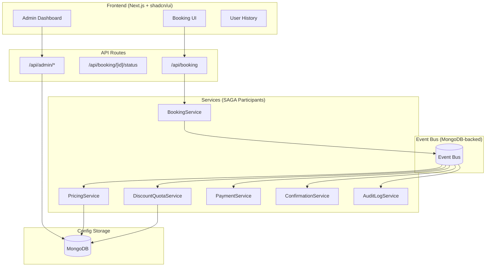

# 🏥 Medical Clinic Booking System

A production-quality medical clinic booking system demonstrating **SAGA Choreography** pattern with event-driven architecture, compensation logic, and real-time status tracking.

## 🎯 Architecture Overview

This system implements a **cloud-style event-driven backend** that processes medical service booking requests with:

- **Distributed transaction flow** using SAGA pattern
- **Choreography-based coordination** (no central orchestrator)
- **Explicit compensation actions** for failure scenarios
- **Structured, traceable logs** with correlation IDs
- **Real-time status updates** via polling
- **Role-based Authentication** via Better Auth
- **Dynamic Configuration** for prices and discount rules



## 📋 Business Rules

### R1 - Dynamic Discount Rule

By default, the system applies a discount (e.g., 12%) if **either**:

- User is **female** AND today is her **birthday**
- OR total **base price > ₹1,000**

> [!NOTE]
> The exact discount percentage is **dynamically configurable** via the Admin Panel.

### R2 - Daily Discount Quota

- System-wide limit: **Configurable per day** (e.g., 100)
- Tracked in MongoDB with IST timezone
- Resets at midnight IST
- When exhausted → booking rejected immediately

## ⚡ Event Flow

### Happy Path

```
[BookingRequested] → [PricingCalculated] → [DiscountQuotaReserved] → [PaymentCompleted] → [BookingConfirmed]
```

### Compensation Path (Payment Failure)

```
[BookingRequested] → [PricingCalculated] → [DiscountQuotaReserved] → [PaymentFailed] → [CompensationTriggered] → [DiscountQuotaReleased] → [BookingFailed]
```

## 🛠️ Tech Stack

| Layer     | Technology                          |
| --------- | ----------------------------------- |
| Frontend  | Next.js 15 (App Router) + shadcn/ui |
| Backend   | Next.js API Routes + Server Actions |
| Auth      | Better Auth (MongoDB Adapter)       |
| Database  | MongoDB                             |
| Event Bus | MongoDB-backed (in-app)             |

## 📚 Documentation

| Document                                 | Description                                    |
| ---------------------------------------- | ---------------------------------------------- |
| [ASSUMPTIONS.md](./ASSUMPTIONS.md)       | All assumptions made during implementation     |
| [TEST_SCENARIOS.md](./TEST_SCENARIOS.md) | Detailed test scenarios with expected outcomes |

## 🚀 Quick Start

### 1. Configure Environment

Create `.env.local`:

```env
MONGODB_URI=mongodb://localhost:27017/medical-clinic
PAYMENT_SIMULATION_MODE=success # success, fail, or random
BETTER_AUTH_SECRET=your-secret-key-at-least-32-characters
BETTER_AUTH_URL=http://localhost:3000
```

### 2. Run Development Server

```bash
npm install
npm run dev
```

### 3. Initialize Admin Account

```bash
npx ts-node scripts/seed-admin.ts
```

Then visit `/admin/login` to sign up with the seeded email and set your password.

## 🌟 Key Features

### � User Experience

- **Persistent Booking**: Progress is automatically saved to `localStorage`, allowing users to resume even after a page refresh.
- **Navigable Steps**: Clickable progress indicators allow users to move back and forth between Patient Info, Services, and Summary.
- **Booking History**: Users can log in to view their past appointments and their real-time SAGA status.

### 👮 Admin Dashboard

- **Live Stats**: Real-time monitoring of booking statuses, event counts, and quota usage.
- **Service Management**: Dynamically update medical service prices and descriptions.
- **Discount Controls**: Adjust the global discount percentage and daily quota limits on the fly.
- **Audit Logs**: Comprehensive logs for all admin actions and system events.

### 🔒 Security & Scoping

- **Role-Based Access (RBAC)**: Strict separation between `user` and `admin` roles.
- **Isolated Scopes**: Admins cannot create bookings as themselves; they are prompted to use a regular user account for the booking flow.

## 📁 Project Structure

```
├── app/
│   ├── (auth)/         # Login and signup pages
│   ├── admin/          # Dashboard, services, and log management
│   ├── api/
│   │   ├── admin/      # Protected admin-only APIs
│   │   ├── booking/    # SAGA initiation and status tracking
│   │   ├── services/   # Medical service catalog
│   │   └── config/     # Dynamic configuration endpoints
│   ├── history/        # User personal booking history
│   └── page.tsx        # Responsive booking flow
├── components/
│   ├── admin/          # Admin-specific UI components
│   ├── ui/             # shadcn reusable components
│   └── user-nav.tsx    # Role-aware navigation
├── lib/
│   ├── auth/           # Better Auth configuration and server/client utils
│   ├── db/
│   │   └── models/     # MongoDB schemas (Booking, Quota, Config, Logs)
│   ├── events/         # Event Bus and SAGA event types
│   └── services/       # Domain logic (Pricing, Payment, SAGA Orchestrator)
└── scripts/            # Database seeding and migration scripts
```

## 👩‍💼 Admin Capabilities

- **discounts/page.tsx**: Manage daily quota limits via event-driven updates.
- **services/page.tsx**: Edit service prices and set global discount percentages.
- **bookings/page.tsx**: Real-time event timeline for troubleshooting SAGA flows.
- **logs/page.tsx**: Filterable audit trail for accountability.

## 📄 License

MIT
